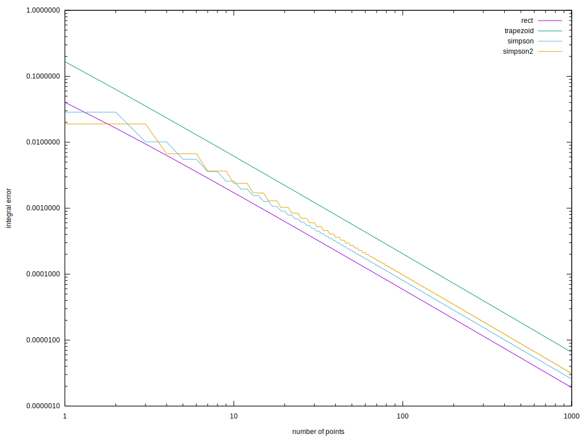
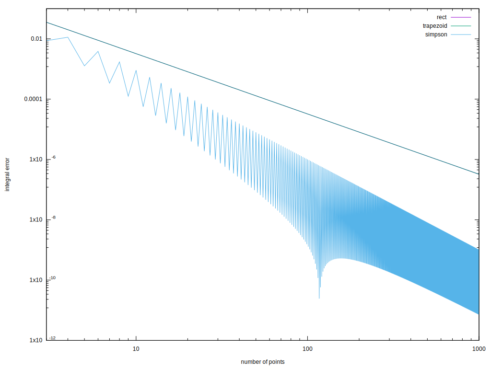
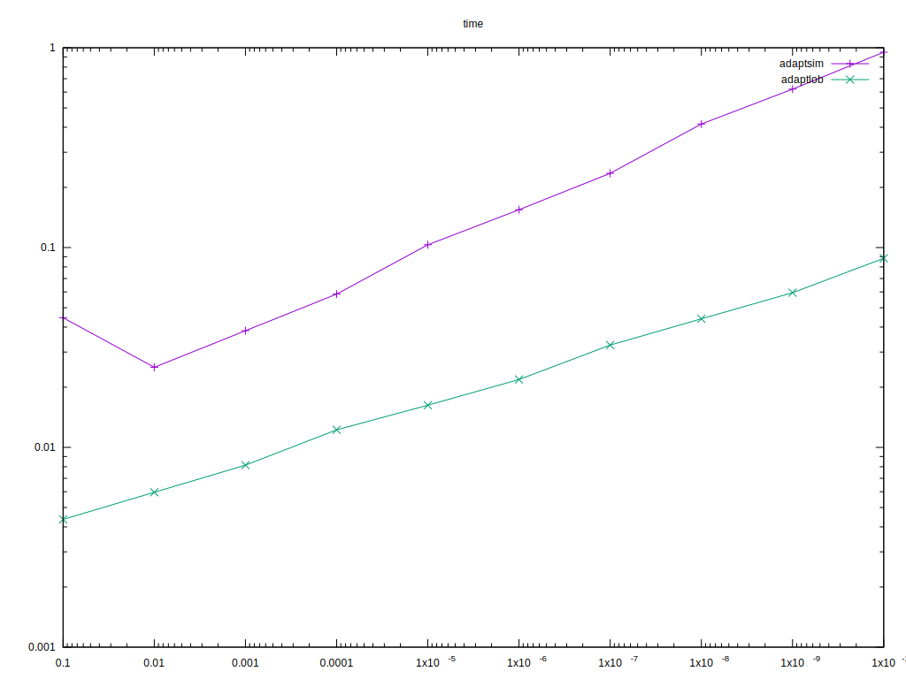
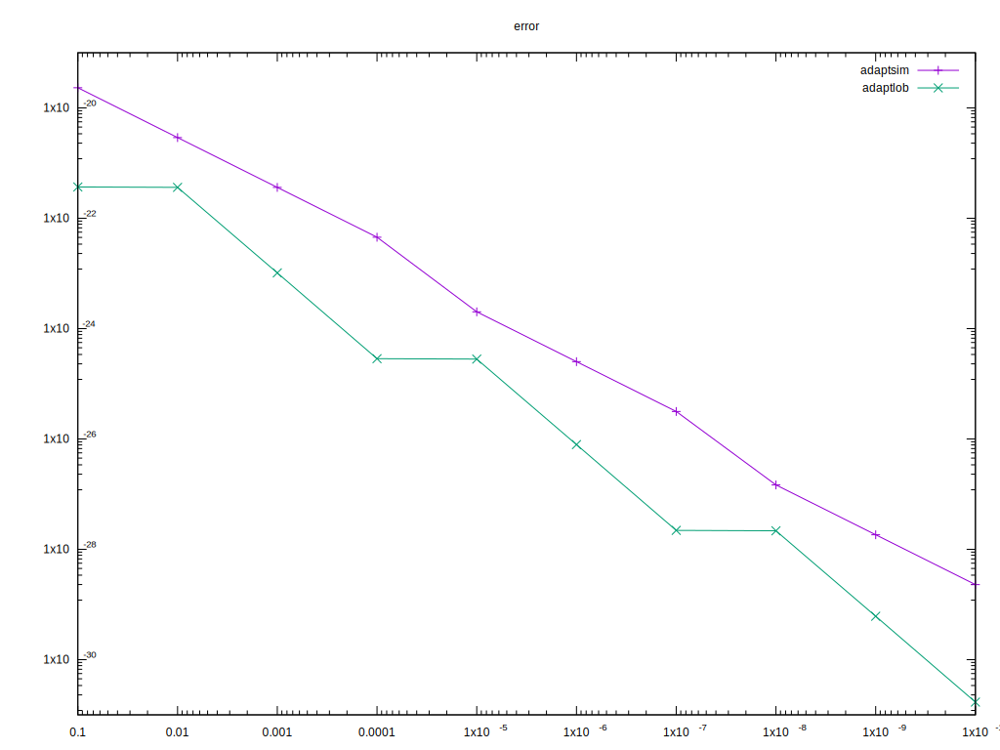

Putting all my integration methods in one place.

ivp/ has initial-value problem integrators

discrete/ has integrators over discrete set of points (x,y)

The test program requires my ext, vec, and plot2d repos.

